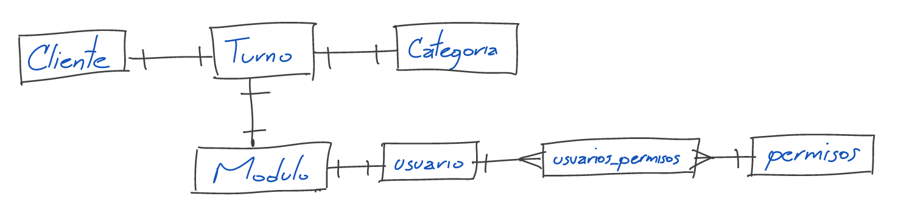

# Diagrama entidad relación

1. __Tabla "clientes"__: información de los usuarios finales que solicitan turnos. Existirian dos tipos de usuario: clientes registrados y cliente no registrados. 

    | Campo                     | Tipo        | Descripción                                         |
    |--------------             |-------------|-----------------------------------------------      |
    | id                        | INT         | Identificador único del cliente                     |
    | tipo_identificacion       | ENUM        | Tipo de identificacion de un enum: cc, pp, ppt, ti  |
    | identificacion            | VARCHAR     | Identificador único del cliente                     |
    | nombre                    | VARCHAR     | Nombre completo del cliente                         |
    | telefono                  | VARCHAR     | Número de teléfono del cliente                      |
    | email                     | VARCHAR     | Dirección de correo electrónico del cliente         |
    | ...                       | ...         | ...                                                 |    

2. __Tabla "usuarios"__: información de los administradores del sistema

    | Campo        | Tipo        | Descripción                                          |
    |--------------|-------------|-----------------------------------------------       |
    | id           | INT         | Identificador único del administrador                |
    | nombre       | VARCHAR     | Nombre completo del administrador                    |
    | contraseña   | VARCHAR     | Contraseña de acceso encriptada                      |
    | email        | VARCHAR     | Dirección de correo electrónico del administrador    |
    | ...          | ...         | ...                                                  |

3. __Tabla "categorias"__: almacenaría las distintas categorías de turnos que se ofrecen, como "urgente", "preferencial", "general".

    | Campo        | Tipo        | Descripción                                   |
    |--------------|-------------|-----------------------------------------------|
    | id           | INT         | Identificador único de la categoría           |
    | nombre       | VARCHAR     | Nombre descriptivo de la categoría            |
    | descripcion  | VARCHAR     | Descripción detallada de la categoría         |
    | ...          | ...         | ...                                           |

4. __Tabla "modulos"__:  nformación sobre los diferentes módulos de atención a los que pueden ser asignados los turnos

    | Campo        | Tipo             | Descripción                                                     |
    |--------------|-------------     |-----------------------------------------------                  |
    | id           | INT              | Identificador único de la relación                              |
    | id_usuario   | INT              | Identificador usuario asignado al modulo                        |
    | nombre       | VARCHAR          | Identificador del turno relacionado                             |
    | estado       | Booleano         | Indica si el módulo está activo (true) o inactivo (false)       |
    | ...          | ...              | ...                                                             |

5. __Tabla "turnos"__:  detalles de cada turno solicitado por un usuario

    | Campo        | Tipo        | Descripción                                                                  |
    |--------------|-------------|-----------------------------------------------                               |
    | id           | INT         | Identificador único del turno                                                |
    | id_cliente   | INT         | Identificador del cliente relacionado                                        |
    | id_categoria | INT         | Identificador del tipo de turno                                              |
    | id_modulo    | INT         | Identificador del modulo donde será atendido                                 |
    | fecha_hora   | DATETIME    | Fecha y hora de asignación del turno                                         |
    | estado       | VARCHAR     | Estado actual del turno (por ejemplo, "pendiente", "atendido", "cancelado")  |
    | ...          | ...         | ...                                                                          |

6. __Tabla "permisos"__: almacenaría los diferentes permisos que pueden tener los usuarios en la aplicación => gestionar_usuarios, crear_turnos, atender_turnos, 

    | Campo        | Tipo        | Descripción                                   |
    |--------------|-------------|-----------------------------------------------|
    | id           | INT         | Identificador único del permiso               |
    | nombre       | VARCHAR     | Nombre descriptivo del permiso                |
    | descripcion  | VARCHAR     | Descripción detallada del permiso             |
    | ...          | ...         | ...                                           |

7. __Tabla "usuarios_permisos"__ : relación de muchos a muchos entre los usuarios y los permisos, y almacenaría los permisos asignados a cada usuario

    | Campo        | Tipo        | Descripción                                   |
    |--------------|-------------|-----------------------------------------------|
    | id           | INT         | Identificador único de la relación            |
    | id_usuario   | INT         | Identificador del usuario relacionado         |
    | id_permiso   | INT         | Identificador del permiso relacionado         |
